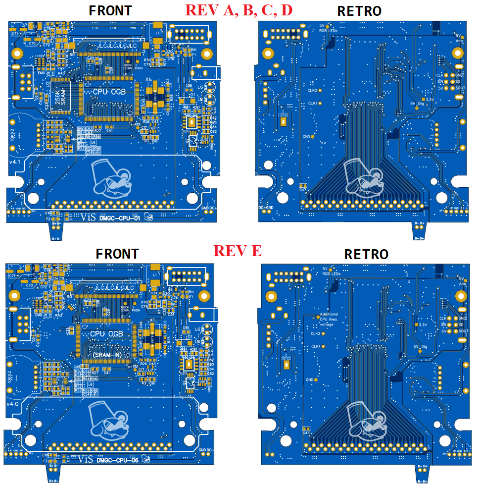
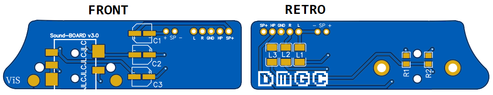

# Production information

Gerber files are located inside ProductionFiles folder in which you can find 1 PCB in each file.
I suggest ENIG surface finish for easier soldering job and longer PCB shelf life.
Finally, all the PCBs are marked with the string "JLCJLCJLCJLC" in a position that will be covered by components or that will not be visible with the assembled Gameboy. If you order from JLCPCB, you can specify the location of the production file through this string, and they will replace "JLCJLCJLCJLC" with the production number in this location.
In the following screenshot you find the way to do this.

The string "JLCJLCJLCJLC" is not present in all the following PCB images since I added it after doing them but they are present in the production files.

## Mainboard PCB (2 layers PCB)

Produce the mainboard PCB with 1 mm or 1.2 mm thickness. Here you have the CPU+RAM version or the RAM-IN-CPU (rev E) version.

## Audio PCB (2 layers PCB)

Produce the audio PCB with 1 mm or 1.2 mm thickness. 

## Audio Jack raiser (2 layers PCB)

Produce Audio Jack raiser PCB with 1.6 mm thickness. If producer contact you by telling that PCB can break you answer to accept this risk and move on the production.

## IPS front PCB (2 layers PCB)

Produce the IPS front PCB with 1 mm or 1.2 mm thickness (I suggest ENIG surface finish for better buttons feeling if you don't use tactile buttons). 

## Audio connector PCB (2 layers PCB)

Produce the Audio connector PCB with 1 mm or less thickness.

