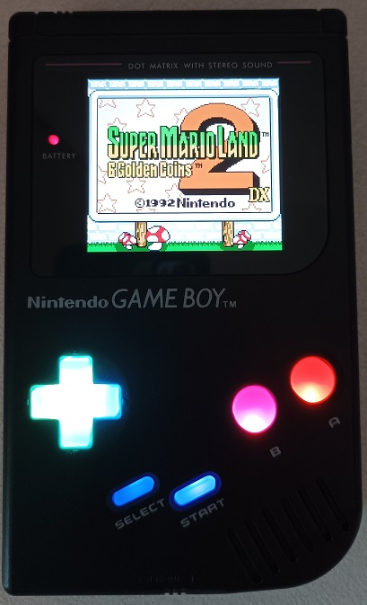
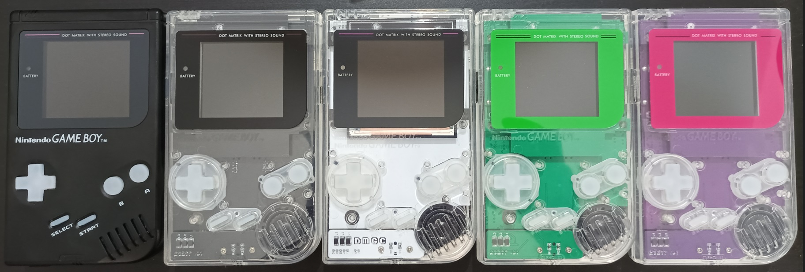

## Ensure to download the last version of the production files before production (v.4.0 for rev E and v4.1 for rev A, B, C or D).

YouTube video [here](https://www.youtube.com/watch?v=p8AL-SyXEpo&t=13s&ab_channel=V1sModding).
Detailed PCB images can be seen in the production info section [here](PCB_info.md).

This is a modified version of the [MouseBitLab](https://github.com/MouseBiteLabs/Game-Boy-DMG-Color) DMGC project. The changes I have made are the following:
- The power board has been placed on the mainboard (it has a proper ground plane separated from the digital ground plane and from the audio ground plane) and it uses a Lipo battery (clearly it includes also the charger circuit).
- The audio board also has been modified in order to connect the speaker directly on it. For this reason the audio signals are not sent from the mainboard to the front board.
- The DMG donor is not required here (only the link port is needed and it can be sourced directly from the 4-player adapter DMG-07 which is cheap and can source 3 link ports).
- This DMGC VIS variant uses also a different DC jack since we need here of a jack capable to handle 2A current for the charger.
- I provide also the mainboard for the CPU-06 (rev E): the version of the CPU with the RAM already in CPU.

## Disclaimer

**This is a DIY project for electronic enthusiasts. For this reason, I am not responsible for any damage incurred while attempting this project or after completion of the project. You alone accept all risk since you are 100% liable for damage to yourself or your property.**

## Security information for Lipo Battery
The battery is physically distant form the tp4056 linear charger. In addition are implemented the following features:
- Overcharge and overdischarge protections implemented with the widely used and widespread combo FS8205A - DW01A.
- Load sharing: you can safely play while charging the battery since the battery is disconnected from the load while charging (I use the same circuit of SYF Game Gear since its creator allowed me to use it). 

## Required Donor parts

In this project, the **strictly required donor parts** are only 
  - the **CPU** (that can be sourced from a donor CGB mainboard). For rev E version you need to grab also U11 component from the donor GBC.
  - the **link-port** (that can be sourced from a donor DMG mainboard or from a 4-player adapter DMG-07).

Other **optional components to desolder** from a donor console are:
  - **RAM** chip can be sourced from a donor CGB mainboard or it can be purchased (see BOM file).
  - **Card slot connector and volume wheel** can be sourced from a donor DMG mainboard or can be simply purchased on Aliexpress.
  - **Quartz oscillator** can be sourced from the donor GBC or it can be purchased (see BOM file).
  - **Power switch** can be sourced from a donor DMG mainboard, or a brand new switch can be purchased at any electronic components shop (see BOM file).

## Required Parts to purchase or reuse

  - **All the electronic components** reported in the BOM file.
  - **Housing DMG shell case** (optional if you already have one).
  - **Screen Kit** This is the important one. You need this specific type of kit
      - the Q5 IPS with OSD. It goes by many names, the maker is Hispeedido (*not* FunnyPlaying). Kits that have the screen laminated to a GBC lens are *not* compatible, but kits that include a lit-up logo on the bottom part of the screen are fine to use. Make sure you DO NOT get any Game Boy DMG versions - they are not compatible! Also, be sure to test this screen kit before installing it, preferrably with an original Game Boy Color. Sometimes they arrive damaged, and once you've installed, it may not be possible to get a refund.
      - RGRS: <a href="https://retrogamerepairshop.com/products/game-boy-color-q5-ips-backlight-with-osd?variant=37646279213228">GBC Q5 XL IPS Backlight with OSD</a> OR <a href="https://retrogamerepairshop.com/collections/gbc-displays/products/game-boy-color-q5-osd-ips-kit-with-color-changing-logo?variant=41819042185388">Game Boy Color Q5 OSD IPS Kit with Color Changing Logo 
      - AliExpress: <a href="https://www.aliexpress.us/item/3256801650459088.html?spm=a2g0o.productlist.main.1.758e53f17WUFK2&algo_pvid=24ef67e3-d608-4269-a663-05eafed1bd17&algo_exp_id=24ef67e3-d608-4269-a663-05eafed1bd17-0&pdp_npi=3%40dis%21USD%2145.9%2145.9%21%21%21%21%21%4021224e9b16816641208271256d074d%2112000017802039303%21sea%21US%210&curPageLogUid=dCymHIE0cr4X">GBC Q5 IPS LCD Kit</a>
      - HHL: <a href="https://handheldlegend.com/products/game-boy-color-ips-lcd-q5-hispeedido">Game Boy Color IPS LCD Q5 - Hispeedido</a>
  - **Lens:** You must get the "IPS" style of lens, as the viewing area is larger.
    -	RGRS: <a href="https://retrogamerepairshop.com/collections/dmg-lenses/products/funnyplaying-dmg-q5-ips-lens?variant=39626455187628">FunnyPlaying DMG Q5 IPS Lens</a>
    - FunnyPlaying: <a href="https://funnyplaying.com/products/dmg-retro-pixel-ips-glass-lens">DMG RetroPixel IPS Glass Lens</a>
  - **Screen Centering Bracket:** In the STL_3D_printer_files you can find:
    -  *dmgc_q5_bracket.stl*: it is the original bucket design (the screen is not covered by the bracket).
    -  *Vis_variant_LCD_bracket.stl*: it is a variant in which the screen is behind the bracket and in this case you need to apply hot glue to keep fix it.
  - **3.7V 125054 Lipo battery** (optional if you want to use only the DC jack).
  - **Kitsch-Bent full silicone buttons** (optional).
  - **1 Watt speaker** (optional if you want to use the original DMG speaker).  You can find (in the files of this project) the 3D model of the holder that you can use to take it in place without glue it to the housing shell (the holder fit the Retrosix 23 mm 1 watt speaker). If you buy 1 watt speaker please buy an high quality speaker from Retrosix (those that I use) or Handheldlegend avoiding cheap speakers.
  - **2 Watt speaker** (optional if you want to use the original DMG speaker). You can buy 28 mm of a very good quality here [Link Aliexpress](https://www.aliexpress.com/item/33037641624.html).
  - **wires and ph2.0 housing connectors** (optional) reported in the last sections of the BOM file.
  - **PH2.0 2.0mm Metal Crimp Pin Terminal Wire Cable for Housing PH 2.0 Female Socket Connector** (optional) that can be purchased here [Link Aliexpress](https://www.aliexpress.com/item/1005004266276874.html).
  - **5v 2A USB-C charger with the 2A cable USB adapter** (I suggest the right angle version) that can be purchased here [Link Aliexpress](https://www.aliexpress.com/item/4000285082506.html).
  - If you decide to use the **audio connector PCB** you can buy the 2.0 mm pitch headers from here [Link Aliexpress](https://www.aliexpress.com/item/4000694199194.html).
  - I suggest to use **full silicone buttons from Kitsch-Bent** as shown in this [short video](https://www.youtube.com/watch?v=DBGJTIemyE4&t=64s&ab_channel=V1sModding).
- I suggest to use **Kamicane USB-C Gasket** to refine the USB-C hole [3D model here](https://www.printables.com/it/model/217706-usb-type-c-gasket).

## Boards compatibility

  - Audio board is not compatible with exisisting gameboy boards and also with my previous Gameboy realeses.
  - MouseBiteLabs front IPS board can be used but in this case lines and ground planes are not kept separated. Anyway, the speaker must be connected in any case to the audio board.

## How produce the PCBs

link [here](PCB_info.md).

## How populate PCBs

Start by populating the power circuit shown in the following image.

After that test the voltages on the back by using the pads highlighted in the following image ("Additional CPU lines voltage" pad is present only for the REV E. Here you should get something between 1.8 - 2.5 V) and test also the Lipo charger.

At this point you can finish to populate all the PCBs similarly to the MouseBitLabs DMGC. For the audio/USB-C connector please referr to the final part of the DMG v2 video [link](https://www.youtube.com/watch?v=zv3Ng8fEEQI&t=5s&ab_channel=V1sModding).

Finally, all the 7 mm tatcile switches have the same orientation. Referr to the following image for the orientation.

Other details can be found on the YouTube video [here](https://www.youtube.com/watch?v=p8AL-SyXEpo&t=13s&ab_channel=V1sModding).

## Credits

  - [Bucket Mouse](https://github.com/MouseBiteLabs/) for the [DMGC](https://github.com/MouseBiteLabs/Game-Boy-DMG-Color) project from which I started for this variant.

  - [consolesandcasks or Deceptive thinker](https://github.com/consolesandcasks) for another [Heavy CPU MGB](https://github.com/ConsolesandCasks/CPU-MGB-Heavy) project that I referenced and utilized to update the actual DC Jack.

  - [Kamicane](https://github.com/kamicane/) for the [Super DMG](https://github.com/kamicane/Super-DMG-01) project from wich I get the audio board shape.

  - [Reverse Retro Engineering](https://linktr.ee/reverseretro) for the help in design the rev E CPU.

## Acknowledgements

I would like to thank Mathijs (the creator of SYF Game Gear PCBs) for his several suggestions, schematics, and help in this project. I would like to thank also Luke from Retrosix for some usefull suggestions.

## License
 This work is licensed under a <a rel="license" href="http://creativecommons.org/licenses/by-sa/4.0/">Creative Commons Attribution-ShareAlike 4.0 International License</a>. You are able to copy and redistribute the material in any medium or format, as well as remix, transform, or build upon the material for any purpose (even commercial) - but you **must** give appropriate credit, provide a link to the license, and indicate if any changes were made.

## Support VIS projects

I have several stuffs in mind, and I will also share my normal Gameboy DMG work [YouTube Channel](https://www.youtube.com/channel/UC17bQxOnCBejYQG4rzEg3jA), but since developing these things has a high cost in materials and prototypes, a little [PayPal](https://www.paypal.com/donate/?hosted_button_id=RJM3TVFW38ZXL) donation is appreciated.

## Contacts

**email**: vis.modding@gmail.com  

**discord**: you can find me as *vis_modding* on several servers (BennVenn, Mouse Bit Lab, Retrosix modding, Game Boy, Gameboy makers).

